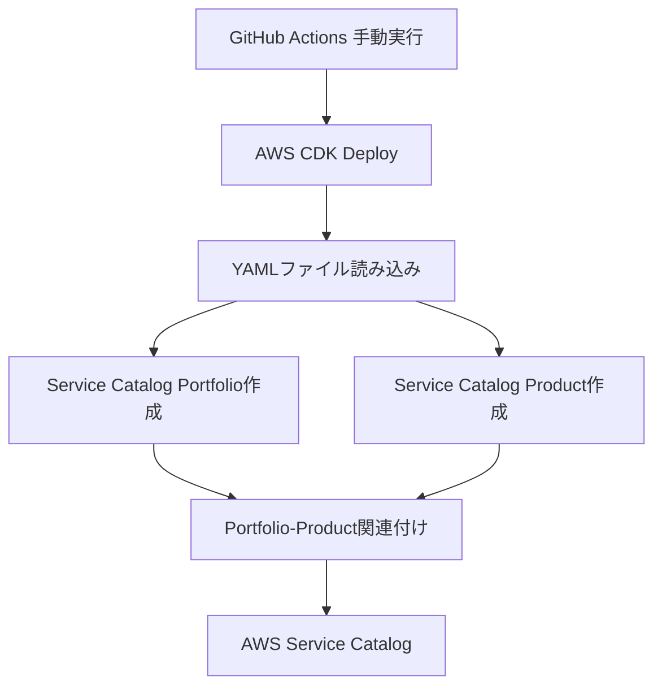

# 設計書

## 概要

AWS CDKを使用してAWSサービスカタログにポートフォリオとプロダクトを登録する最小限のシステム。GitHub Actionsの手動実行により、既存のYAMLファイルからメタデータを読み込み、CloudFormationテンプレートをサービスカタログに登録する。

## アーキテクチャ

### システム構成



### ファイル構造

```
.
├── .github/workflows/
│   └── service-catalog.yml         # 手動実行用GitHub Actions
├── cdk/
│   ├── app.py                      # CDKアプリケーションエントリーポイント
│   ├── service_catalog_stack.py    # Service Catalogスタック
│   ├── cdk.json                    # CDK設定ファイル
│   └── requirements.txt            # Python依存関係
└── portfolios/
    └── development/
        ├── portfolio.yaml          # ポートフォリオ設定
        └── ec2-instances/
            ├── product.yaml        # プロダクト設定
            └── v1.0.0/
                └── template.yaml   # CloudFormationテンプレート
```

## コンポーネントと インターフェース

### 1. GitHub Actions ワークフロー

**ファイル:** `.github/workflows/service-catalog.yml`

**責任:**
- 手動実行トリガー
- OIDC認証によるAWS認証設定
- CDKデプロイメント実行

**インターフェース:**
- 入力: 手動実行トリガー
- 出力: デプロイメント結果

### 2. CDK アプリケーション

**ファイル:** `cdk/app.py`

**責任:**
- CDKアプリケーションの初期化
- スタックのインスタンス化

**インターフェース:**
- 入力: なし
- 出力: CDKスタック

### 2.1. CDK設定ファイル

**ファイル:** `cdk/cdk.json`

**責任:**
- CDKアプリケーションの設定
- エントリーポイントの指定

### 3. Service Catalog スタック

**ファイル:** `cdk/service_catalog_stack.py`

**責任:**
- YAMLファイルの読み込み
- Service Catalogリソースの作成
- Portfolio-Product関連付け

**インターフェース:**
- 入力: YAMLファイル（portfolio.yaml, product.yaml, template.yaml）
- 出力: AWS Service Catalogリソース

## データモデル

### Portfolio設定 (portfolio.yaml)

```yaml
name: string              # ポートフォリオ名
description: string       # ポートフォリオ説明
owner: string            # 所有者メールアドレス
```

### Product設定 (product.yaml)

```yaml
name: string                    # プロダクト名
description: string             # プロダクト説明
owner: string                  # 所有者メールアドレス
support_description: string    # サポート説明
support_email: string          # サポートメールアドレス
support_url: string            # サポートURL
```

### CloudFormationテンプレート (template.yaml)

- 標準のCloudFormationテンプレート形式
- AWSTemplateFormatVersion: '2010-09-09'
- Parameters, Resources, Outputs セクションを含む

## 実装詳細

### CDKスタック実装

**主要クラス:**
- `ServiceCatalogStack`: メインのCDKスタック
- YAMLファイル読み込み機能
- Service Catalogリソース作成機能

**AWS CDKリソース:**
- `aws_servicecatalog.Portfolio`: ポートフォリオ
- `aws_servicecatalog.CloudFormationProduct`: プロダクト
- `aws_servicecatalog.PortfolioProductAssociation`: 関連付け

### ファイル読み込み処理

1. `portfolios/development/portfolio.yaml` を読み込み
2. `portfolios/development/ec2-instances/product.yaml` を読み込み
3. `portfolios/development/ec2-instances/v1.0.0/template.yaml` を読み込み
4. 各設定値をCDKリソースに適用

### GitHub Actions設定

**トリガー:** `workflow_dispatch` (手動実行のみ)

**ステップ:**
1. リポジトリチェックアウト
2. Python環境セットアップ
3. OIDC認証によるAWS認証設定
4. CDK依存関係インストール
5. CDKデプロイ実行

### OIDC認証設定

**認証方式:** OpenID Connect (OIDC)

**設定要素:**
- IAMロールARN: GitHubシークレット変数で管理
- AWSリージョン: GitHubシークレット変数で管理
- configure-aws-credentialsアクション使用

## テスト戦略

テスト機能は実装しない（要件により除外）

## エラーハンドリング

エラーハンドリング機能は実装しない（要件により除外）