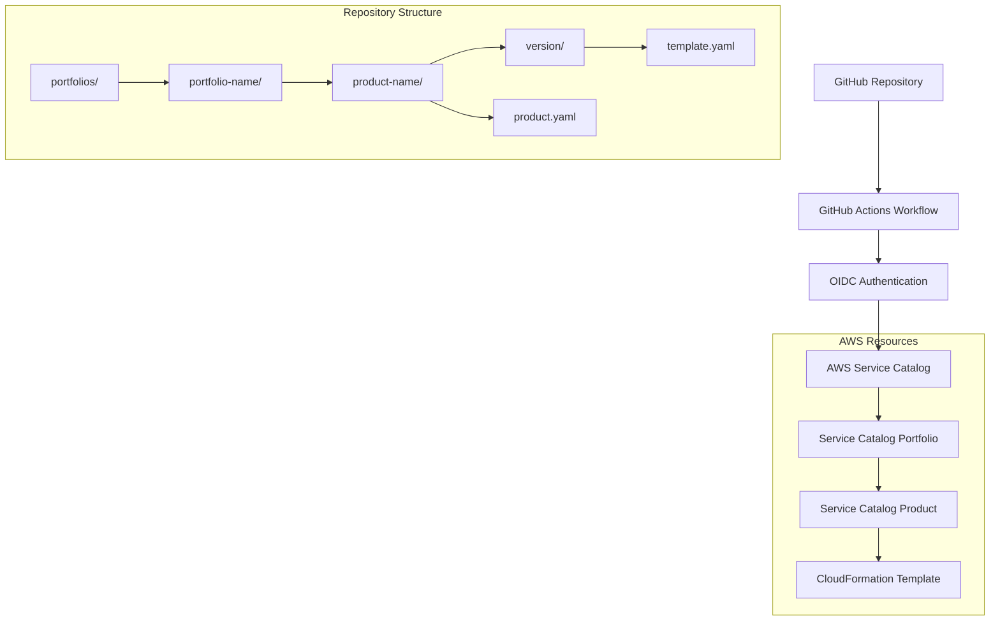

# 設計書

## 概要

AWSサービスカタログの自動化システムは、GitHubリポジトリの変更を検知してAWSサービスカタログにプロダクトを自動登録するCI/CDパイプラインです。OIDC認証を使用してセキュアにAWSに接続し、フォルダ構造ベースでプロダクトとバージョンを管理します。

## アーキテクチャ

### システム構成図



### データフロー

1. **変更検知**: GitHub Actionsがpushイベントでトリガー
2. **認証**: OIDC プロバイダーを使用してAWS認証
3. **解析**: フォルダ構造を解析してポートフォリオ・プロダクト情報を抽出
4. **登録**: AWS CLIまたはCDKを使用してサービスカタログに登録

## コンポーネントと インターフェース

### 1. GitHub Actions ワークフロー

**ファイル**: `.github/workflows/service-catalog.yml`

**責任**:
- pushイベントの検知
- 変更されたファイルの特定
- AWS認証の実行
- サービスカタログ操作の実行

**入力**:
- GitHub Secrets (AWS_REGION, AWS_ACCOUNT_ID, AWS_ROLE_ARN)
- リポジトリファイル変更

**出力**:
- ワークフロー実行ログ
- AWS リソース作成結果

### 2. フォルダ構造管理

**構造**:
```
portfolios/
├── development/              # ポートフォリオ名
│   ├── portfolio.yaml       # ポートフォリオ設定
│   └── ec2-instances/        # プロダクト名
│       ├── product.yaml      # プロダクト設定
│       ├── v1.0.0/          # バージョン
│       │   └── template.yaml # CloudFormationテンプレート
│       └── v1.1.0/
│           └── template.yaml
└── production/
    └── database-services/
        ├── product.yaml
        └── v1.0.0/
            └── template.yaml
```

### 3. 設定ファイル形式

**portfolio.yaml**:
```yaml
name: "Development Portfolio"
description: "開発環境用のリソーステンプレート"
owner: "development-team@company.com"
```

**product.yaml**:
```yaml
name: "EC2 Instances"
description: "Ubuntu 24.04 ARM SSM対応EC2インスタンス"
owner: "infrastructure-team@company.com"
support_description: "インフラチームがサポートします"
support_email: "infrastructure-team@company.com"
support_url: "https://wiki.company.com/ec2-support"
```

### 4. AWS CLI スクリプト

**ファイル**: `scripts/deploy-catalog.sh`

**機能**:
- ポートフォリオの作成・更新
- プロダクトの作成・更新
- プロダクトバージョンの追加
- エラーハンドリング

### 5. AWS CDK バックアップ実装

**ファイル**: `cdk/service_catalog_stack.py`

**機能**:
- AWS CLIで実装困難な操作のフォールバック
- 複雑なリソース関係の管理
- プログラマティックなエラーハンドリング

## データモデル

### ポートフォリオモデル

```yaml
Portfolio:
  id: string (AWS生成)
  name: string
  description: string
  owner: string
  created_time: datetime
  updated_time: datetime
```

### プロダクトモデル

```yaml
Product:
  id: string (AWS生成)
  name: string
  description: string
  owner: string
  portfolio_id: string
  support_description: string
  support_email: string
  support_url: string
  created_time: datetime
  updated_time: datetime
```

### プロダクトバージョンモデル

```yaml
ProductVersion:
  id: string (AWS生成)
  product_id: string
  version_name: string
  template_url: string
  description: string
  created_time: datetime
  active: boolean
```

## エラーハンドリング

### 1. 認証エラー

**シナリオ**: OIDC認証失敗
**対応**: 
- 詳細なエラーメッセージをログ出力
- GitHub Secretsの設定確認を促すメッセージ
- ワークフロー即座停止

### 2. テンプレート検証エラー

**シナリオ**: CloudFormationテンプレート構文エラー
**対応**:
- AWS CLI validate-templateでの事前検証
- 詳細な構文エラー情報の出力
- 該当ファイルパスの明示

### 3. リソース競合エラー

**シナリオ**: 同名リソースの重複作成
**対応**:
- 既存リソースの確認
- 更新操作への自動切り替え
- 競合解決ログの出力

### 4. 権限エラー

**シナリオ**: IAMロールの権限不足
**対応**:
- 必要な権限の明示
- 権限設定ガイドへのリンク提供
- 具体的なポリシー例の提示

## テスト戦略

### 1. 単体テスト

**対象**:
- 設定ファイル解析ロジック
- AWS CLI コマンド生成
- エラーハンドリング関数

**ツール**: pytest (Python部分)

### 2. 統合テスト

**対象**:
- GitHub Actions ワークフロー全体
- AWS サービスとの連携
- OIDC認証フロー

**環境**: テスト用AWSアカウント

### 3. エンドツーエンドテスト

**シナリオ**:
1. 新規ポートフォリオ・プロダクト作成
2. 既存プロダクトへのバージョン追加
3. エラー条件での動作確認

**検証項目**:
- サービスカタログでのリソース確認
- CloudFormationテンプレートの起動テスト
- ログ出力の妥当性

### 4. サンプルプロダクトテスト

**テンプレート**: Ubuntu 24.04 ARM SSM EC2インスタンス
**検証**:
- テンプレートの構文正確性
- インスタンス起動の成功
- SSM接続の動作確認

## セキュリティ考慮事項

### 1. 認証・認可

- OIDC認証によるアクセスキー不要化
- 最小権限の原則に基づくIAMロール設計
- GitHub Secretsでの機密情報管理

### 2. テンプレート検証

- CloudFormationテンプレートの事前検証
- 危険なリソース作成の防止
- リソース制限の実装

### 3. ログ管理

- 機密情報のログ出力防止
- 監査ログの適切な保存
- エラー情報の適切なマスキング

## パフォーマンス考慮事項

### 1. ワークフロー最適化

- 変更検知の効率化（paths-ignore使用）
- 並列処理の活用
- キャッシュ機能の利用

### 2. AWS API呼び出し最適化

- バッチ処理の活用
- 不要なAPI呼び出しの削減
- レート制限への対応

### 3. スケーラビリティ

- 大量プロダクト対応
- 同時実行制御
- リソース使用量の監視