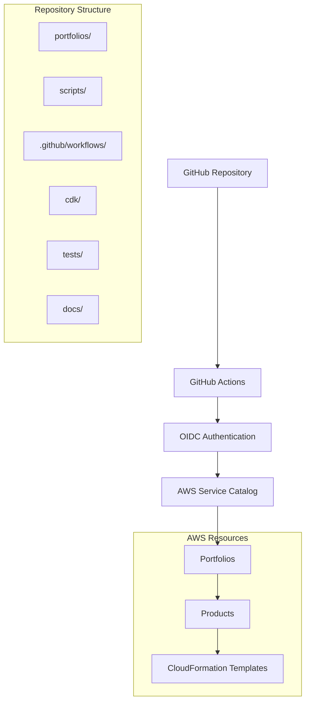
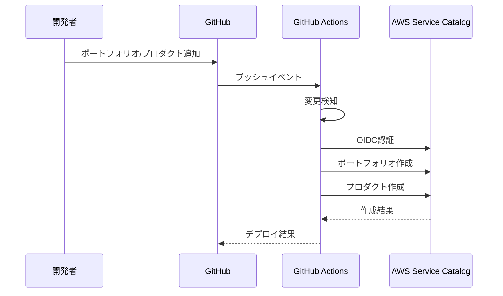
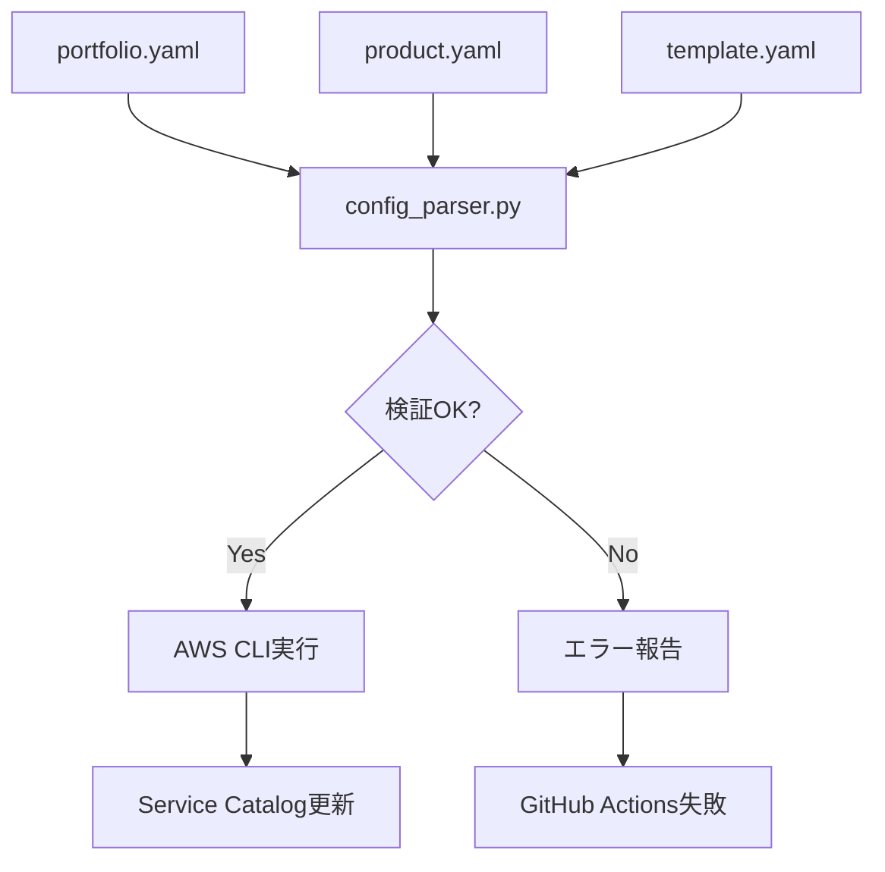

# AWS Service Catalog 自動化システム - プロジェクト構造

このドキュメントでは、AWS Service Catalog 自動化システムの全体的なプロジェクト構造について説明します。

## 🏗️ アーキテクチャ概要



## 📁 ディレクトリ構造

```
aws-service-catalog-automation/
├── 📂 .github/
│   └── 📂 workflows/
│       └── 📄 service-catalog.yml          # メインワークフロー
├── 📂 .kiro/
│   └── 📂 specs/                           # Kiro仕様書
│       └── 📂 aws-service-catalog-automation/
│           ├── 📄 requirements.md          # 要件定義
│           ├── 📄 design.md               # 設計書
│           └── 📄 tasks.md                # 実装タスク
├── 📂 portfolios/                          # 🎯 メインコンテンツ
│   ├── 📂 development/                     # 開発環境
│   │   ├── 📄 portfolio.yaml              # ポートフォリオ設定
│   │   └── 📂 ec2-instances/               # プロダクト
│   │       ├── 📄 product.yaml            # プロダクト設定
│   │       └── 📂 v1.0.0/                 # バージョン
│   │           └── 📄 template.yaml       # CFnテンプレート
│   └── 📂 production/                      # 本番環境（例）
├── 📂 scripts/                             # 🔧 管理スクリプト
│   ├── 🐍 config_parser.py               # 設定解析
│   ├── 🐍 detect-changes.py              # 変更検知
│   ├── 🔨 manage-portfolio.sh            # ポートフォリオ管理
│   ├── 🔨 manage-product.sh              # プロダクト管理
│   └── 🔨 deploy-catalog.sh              # 統合デプロイ
├── 📂 cdk/                                # ☁️ AWS CDK
│   ├── 🐍 app.py                         # CDKアプリ
│   ├── 🐍 service_catalog_stack.py       # スタック定義
│   ├── 🐍 deploy_with_cdk.py            # デプロイスクリプト
│   └── 📄 requirements.txt               # Python依存関係
├── 📂 templates/                          # 📋 テンプレート
│   ├── 📄 portfolio.yaml.template        # ポートフォリオ雛形
│   └── 📄 product.yaml.template          # プロダクト雛形
├── 📂 tests/                              # 🧪 テスト
│   ├── 🐍 test_config_parser.py          # 設定解析テスト
│   ├── 🐍 test_detect_changes_fixed.py   # 変更検知テスト
│   ├── 🐍 test_aws_cli_commands.py       # AWS CLIテスト
│   ├── 🐍 run_tests.py                   # テスト実行
│   └── 📄 requirements.txt               # テスト依存関係
├── 📂 docs/                               # 📚 ドキュメント
│   ├── 📄 FOLDER_STRUCTURE.md            # フォルダ構造詳細
│   └── 📄 TROUBLESHOOTING.md             # トラブルシューティング
├── 📄 README.md                           # メインドキュメント
├── 📄 STRUCTURE.md                        # このファイル
└── 📄 requirements.txt                    # Python依存関係
```

## 🎯 主要コンポーネント

### 1. portfolios/ - コンテンツ管理

**目的**: AWS Service Catalog のポートフォリオとプロダクトを定義

**構造**:
```
portfolios/
└── [環境名]/
    ├── portfolio.yaml              # ポートフォリオ設定
    └── [プロダクト名]/
        ├── product.yaml            # プロダクト設定
        └── [バージョン]/
            └── template.yaml       # CloudFormationテンプレート
```

**特徴**:
- 環境別の分離（development, staging, production）
- バージョン管理によるテンプレート履歴
- 宣言的な設定管理

### 2. scripts/ - 自動化エンジン

**目的**: デプロイメントとメンテナンスの自動化

**主要スクリプト**:

| スクリプト | 言語 | 目的 |
|---|---|---|
| `config_parser.py` | Python | YAML設定の解析・検証 |
| `detect-changes.py` | Python | Git変更の検知・分析 |
| `manage-portfolio.sh` | Bash | ポートフォリオのCRUD操作 |
| `manage-product.sh` | Bash | プロダクトのCRUD操作 |
| `deploy-catalog.sh` | Bash | 統合デプロイメント |

**特徴**:
- モジュラー設計
- エラーハンドリング
- DRY_RUNモード対応
- 詳細ログ出力

### 3. .github/workflows/ - CI/CD パイプライン

**目的**: GitHub Actions による自動デプロイ

**ワークフロー**:
```yaml
name: Deploy Service Catalog
on:
  push:
    branches: [main]
    paths: ['portfolios/**']
jobs:
  deploy:
    runs-on: ubuntu-latest
    permissions:
      id-token: write
      contents: read
    steps:
      - uses: actions/checkout@v4
      - name: Configure AWS credentials
        uses: aws-actions/configure-aws-credentials@v4
        with:
          role-to-assume: ${{ secrets.AWS_ROLE_ARN }}
          aws-region: ${{ secrets.AWS_REGION }}
      - name: Deploy changes
        run: scripts/deploy-catalog.sh deploy-changes
```

**特徴**:
- OIDC認証
- 変更検知ベースデプロイ
- セキュアな認証情報管理

### 4. cdk/ - 高度な操作

**目的**: AWS CLIで困難な操作のフォールバック

**構成**:
- `app.py`: CDKアプリケーションエントリーポイント
- `service_catalog_stack.py`: Service Catalogリソース定義
- `deploy_with_cdk.py`: デプロイメントロジック

**特徴**:
- 複雑なリソース関係の管理
- プログラマティックなエラーハンドリング
- AWS CLIの補完

### 5. tests/ - 品質保証

**目的**: システムの信頼性確保

**テストカバレッジ**:
- 設定ファイル解析
- 変更検知ロジック
- AWS CLI コマンド生成
- エラーハンドリング

**実行方法**:
```bash
python3 tests/run_tests.py
```

## 🔄 データフロー

### 1. 開発フロー



### 2. 設定処理フロー



## 🛠️ 技術スタック

### 言語・フレームワーク

| 技術 | 用途 | バージョン |
|---|---|---|
| Python | 設定解析、テスト | 3.8+ |
| Bash | システム管理 | 4.0+ |
| YAML | 設定ファイル | 1.2 |
| AWS CDK | インフラ定義 | 2.x |

### AWS サービス

| サービス | 用途 |
|---|---|
| Service Catalog | プロダクト管理 |
| CloudFormation | リソース定義 |
| IAM | 認証・認可 |
| S3 | 大きなテンプレート保存 |

### 開発ツール

| ツール | 用途 |
|---|---|
| GitHub Actions | CI/CD |
| pytest | 単体テスト |
| jq | JSON処理 |
| yamllint | YAML検証 |

## 📊 メトリクスと監視

### 1. システムメトリクス

```bash
# ポートフォリオ数
find portfolios/ -name "portfolio.yaml" | wc -l

# プロダクト数
find portfolios/ -name "product.yaml" | wc -l

# バージョン数
find portfolios/ -name "template.yaml" | wc -l
```

### 2. 品質メトリクス

```bash
# テストカバレッジ
python3 tests/run_tests.py

# 設定ファイル検証
scripts/deploy-catalog.sh validate
```

### 3. パフォーマンスメトリクス

- GitHub Actions実行時間
- AWS API呼び出し回数
- デプロイ成功率

## 🔒 セキュリティ考慮事項

### 1. 認証・認可

- **OIDC認証**: 長期間有効なアクセスキー不要
- **最小権限**: 必要最小限のIAM権限
- **リポジトリ制限**: 特定リポジトリからのみアクセス

### 2. データ保護

- **機密情報**: GitHub Secretsで管理
- **ログ**: 機密情報のマスキング
- **テンプレート**: 事前検証

### 3. 監査

- **操作ログ**: すべての操作を記録
- **変更履歴**: Gitによるバージョン管理
- **アクセス制御**: GitHub権限による制御

## 🚀 スケーラビリティ

### 1. 水平スケーリング

- **並列処理**: 複数プロダクトの同時デプロイ
- **リージョン分散**: 複数リージョンでの運用
- **チーム分離**: ポートフォリオ単位での管理

### 2. 垂直スケーリング

- **大きなテンプレート**: S3を使用した管理
- **複雑な依存関係**: CDKによる高度な制御
- **カスタム処理**: 拡張可能なスクリプト構造

## 📈 将来の拡張

### 1. 機能拡張

- **マルチリージョン対応**: 複数リージョンでの同期デプロイ
- **承認ワークフロー**: プルリクエストベースの承認
- **通知機能**: Slack/Teams連携

### 2. 運用改善

- **メトリクス収集**: CloudWatchとの連携
- **自動テスト**: より包括的なテストスイート
- **ドキュメント生成**: 自動ドキュメント更新

## 🤝 コントリビューション

### 1. 開発プロセス

1. Issueの作成
2. フィーチャーブランチの作成
3. 実装とテスト
4. プルリクエストの作成
5. レビューとマージ

### 2. コーディング規約

- **Python**: PEP 8準拠
- **Bash**: ShellCheckによる検証
- **YAML**: yamllintによる検証
- **ドキュメント**: 日本語での記述

この構造により、スケーラブルで保守性の高いAWS Service Catalog自動化システムを実現しています。